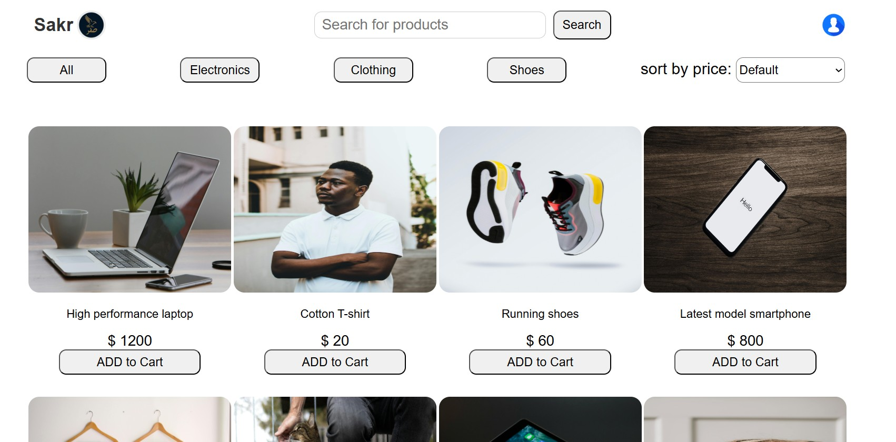

# 🛒 Mini E-Commerce App (v1.0)

A clean, interactive, and fully responsive e-commerce product catalog built using **HTML**, **CSS**, and **JavaScript**.  
📌 **Note:** This is the **first version** — more features and updates coming soon!

## 🚀 Features

- 🔍 **Search products by name**
- 🎛️ **Filter products by category** (Electronics, Clothing, Shoes, etc.)
- 📊 **Sort products by price** (Low to High / High to Low)
- 📱 **Fully responsive layout** for mobile, tablet, and desktop
- 🗂️ Modular clean code structure (controller, view, main files)

## 📸 Screenshot

## 🔗 Live Demo

[👉 View App Demo](https://youtu.be/1Bxghzb4ENs)

## 💾 Tech Stack

- **HTML5**
- **CSS3**
- **Vanilla JavaScript (ES6)**
  
## 📌 Version Info

This is the **first version** of the project.  
Planned upcoming features and improvements include:

- 🛒 Add-to-cart functionality with cart summary
- 📦 Load product data dynamically from a JSON file
- 🎨 Custom themes and UI enhancements

Stay tuned for updates! 🚀

## 📌 Author

**Sakr (صقر)**  
MERN Stack Developer  
[GitHub Profile](https://github.com/abdallaskar)

---

## 📥 How to Use

1. Clone this repository
2. Open `index.html` in your browser
3. Browse, filter, search, and enjoy the app ✨

---

## 📃 License

This project is open-source and free to use.
